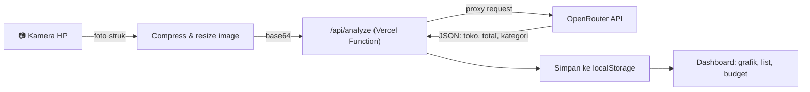

# 💰 Struk Analyzer

Progressive Web App yang otomatis membaca dan mengkategorikan pengeluaran dari foto struk belanja, menggunakan AI vision model. Dibangun sebagai project belajar full-stack — dari integrasi AI, keamanan API, sampai debugging masalah nyata di device production.

**🔗 Live demo:** [struk-analyzer.vercel.app](https://struk-analyzer.vercel.app)

<!--
  Tambahkan screenshot di sini sebelum publish. Contoh:
  
  
-->

---

## ✨ Fitur

- **📷 Foto struk langsung dari kamera HP** — capture langsung, tanpa perlu pilih file manual
- **🤖 Ekstraksi otomatis via AI vision** — nama toko, tanggal, total, dan kategori terbaca otomatis dari foto, tanpa OCR manual
- **📊 Dashboard interaktif** — grafik donat sebaran pengeluaran per kategori
- **💰 Budget alert** — set batas pengeluaran bulanan, progress bar berubah warna kalau kelewat
- **🔍 Search & filter** — cari transaksi by nama toko, filter by kategori dan bulan
- **✏️ Edit & hapus transaksi** — koreksi manual kalau AI salah baca
- **⬇️ Export ke CSV** — laporan pengeluaran siap dibuka di Excel/Sheets
- **🌙 Dark mode** — preferensi tersimpan otomatis
- **📱 Installable (PWA)** — bisa di-"Add to Home Screen", jalan seperti aplikasi native
- **🔒 API key aman di server** — tidak pernah terekspos ke browser/client

---

## 🛠️ Tech Stack

| Layer | Teknologi |
|---|---|
| Frontend | Vanilla HTML, CSS, JavaScript (tanpa framework) |
| Visualisasi | [Chart.js](https://www.chartjs.org/) |
| AI Vision | [OpenRouter](https://openrouter.ai) (model: Gemini 2.5 Flash) |
| Backend | Vercel Serverless Function (Node.js) |
| Penyimpanan data | `localStorage` (client-side, tanpa database) |
| Hosting | [Vercel](https://vercel.com) |
| PWA | Web App Manifest + Service Worker |

Sengaja dibangun tanpa framework frontend supaya fundamentalnya (DOM manipulation, fetch API, event handling) kelihatan jelas — cocok buat portofolio belajar.

---

## 🏗️ Arsitektur



API key OpenRouter disimpan sebagai environment variable di server (`/api/analyze.js`), **tidak pernah dikirim ke browser**. Frontend hanya berkomunikasi dengan endpoint milik sendiri.

---

## 📁 Struktur Project

```
struk-analyzer/
├── api/
│   └── analyze.js        # Serverless function, proxy ke OpenRouter
├── src/
│   ├── icon-192.png
│   └── icon-512.png
├── index.html
├── style.css
├── app.js
├── manifest.json
├── service-worker.js
└── README.md
```

---

## 🚀 Menjalankan di Lokal

1. Clone repo ini
   ```bash
   git clone https://github.com/taufikibraahim/struk-analyzer.git
   cd struk-analyzer
   ```

2. Install [Vercel CLI](https://vercel.com/docs/cli) (untuk menjalankan serverless function di lokal)
   ```bash
   npm install -g vercel
   ```

3. Buat file `.env.local` di root project:
   ```
   OPENROUTER_API_KEY=sk-or-v1-xxxxxxxxxxxx
   ```
   Ambil API key gratis di [openrouter.ai/keys](https://openrouter.ai/keys)

4. Jalankan
   ```bash
   vercel dev
   ```

5. Buka `http://localhost:3000` di browser

> Catatan: karena app ini butuh akses kamera dan Service Worker, sebagian fitur (terutama di HP) hanya berfungsi penuh lewat HTTPS. Untuk testing kamera dari HP di lokal, gunakan tunnel seperti `localtunnel` atau langsung deploy ke Vercel preview.

---

## ☁️ Deploy ke Vercel

1. Push repo ke GitHub
2. Import project di [vercel.com/new](https://vercel.com/new)
3. Tambahkan environment variable di **Settings → Environment Variables**:
   | Key | Value |
   |---|---|
   | `OPENROUTER_API_KEY` | API key dari OpenRouter |
4. Deploy — Vercel otomatis mendeteksi `api/analyze.js` sebagai serverless function

---

## 🧠 Yang Dipelajari / Tantangan Selama Development

Beberapa masalah nyata yang muncul dan cara menyelesaikannya:

- **Model AI deprecated (`404 Not Found`)** — model vision yang awalnya dipakai di-deprecate provider-nya. Solusi: cek daftar model aktif secara berkala di dashboard OpenRouter, bukan hardcode permanen.
- **API key ter-expose di frontend** — awalnya API key ditaruh langsung di `app.js` untuk prototyping cepat. Dipindah ke serverless function (`/api/analyze`) supaya key hanya hidup di server, tidak pernah terkirim ke browser.
- **Gagal khusus di HP, sukses di laptop** — ternyata foto dari kamera HP jauh lebih besar resolusinya dibanding file test di laptop, sampai gagal terkirim. Solusi: resize + compress image di sisi client (`canvas.toDataURL`) sebelum dikirim ke API.
- **Total tidak berubah saat menambah transaksi** — bukan bug, ternyata karena struk uji coba tanggalnya bukan bulan berjalan, sementara dashboard sengaja hanya menghitung transaksi bulan ini.

---

## 🗺️ Roadmap

- [ ] Multi-item per struk (breakdown per barang, bukan cuma total)
- [ ] Sinkronisasi data lintas device (butuh backend database)
- [ ] Notifikasi push saat mendekati/melewati budget
- [ ] Grafik tren pengeluaran dari waktu ke waktu

---

## 📄 Lisensi

MIT License — bebas digunakan, dimodifikasi, dan dikembangkan lebih lanjut.

---

Made with 💜 by **Ibra**